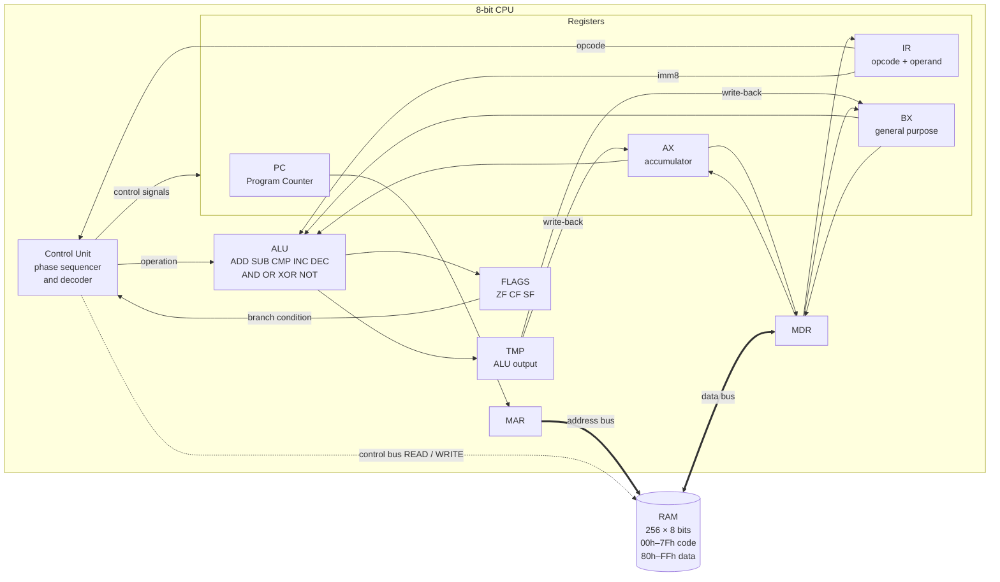
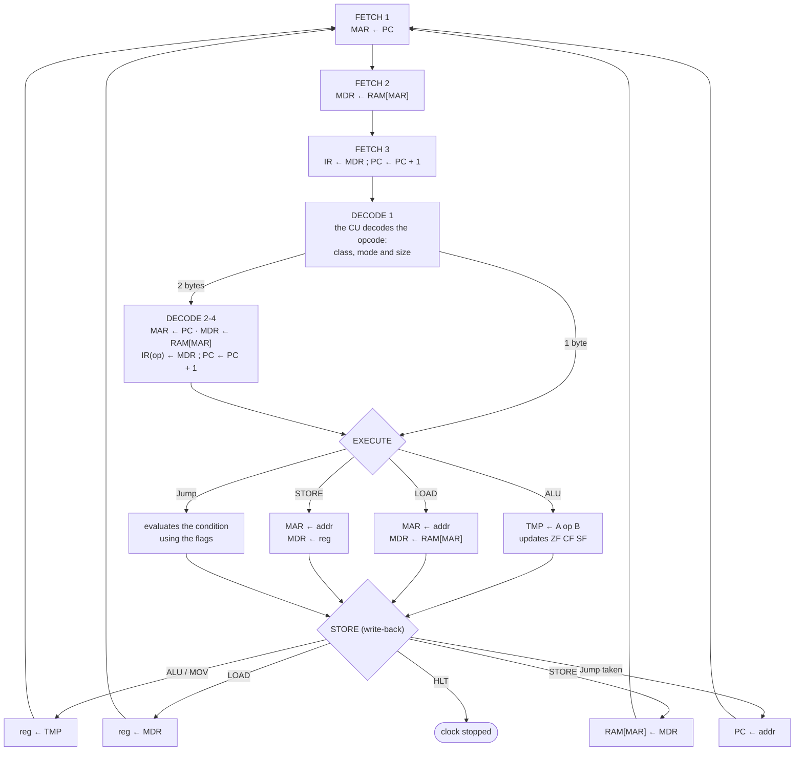

# 8-Bit CPU and Main Memory Simulator (Von Neumann / Simplified x86 Architecture)

**Course:** Computer Architecture (SIS-131)  
**Student:** Maria Alicia Belaunde Villagomez  
**Instructor:** Eng. Paulo César Loayza Carrasco  
**University:** Universidad Católica Boliviana "San Pablo" — Regional Santa Cruz  
**Assessment:** First Midterm — Practical project and oral defense  
**Platform:** Microsoft Excel + VBA (`Parcial 1 - Arquitectura de computadoras.xlsm`)  
**Kanban board:** [GitHub Projects](https://github.com/users/aliciabelaunde/projects/9/views/1)

Interactive simulator that runs 8-bit machine-language programs by breaking every instruction into the four phases of the instruction cycle (**Fetch → Decode → Execute → Store**), and every phase into register-transfer micro-operations. Each clock pulse is shown on the worksheet: the active register, the memory cell being read or written, the current phase, the ALU operation and the status flags.


## Contents

1. [System architecture](#1-system-architecture)
2. [Registers](#2-registers)
3. [Main memory](#3-main-memory)
4. [Instruction cycle and micro-operations](#4-instruction-cycle-and-micro-operations)
5. [Instruction Set Architecture (ISA)](#5-instruction-set-architecture-isa)
6. [User manual](#6-user-manual)
7. [Demonstration program and trace](#7-demonstration-program-and-trace)
8. [Code organization](#8-code-organization)
9. [Tests](#9-tests)
10. [Repository structure](#10-repository-structure)

---

## 1. System architecture

**Von Neumann** architecture: instructions and data share a single memory and a single access path (MAR/MDR and the system buses).



## 2. Registers

| Register | Bits | Function | Worksheet cell |
|---|:---:|---|:---:|
| **PC** | 8 | Address of the next instruction | `B2` |
| **IR** | 8 + 8 | Opcode of the current instruction and its operand (`20 05`) | `B3` |
| **MAR** | 8 | Address placed on the address bus | `B4` |
| **MDR** | 8 | Data just read from RAM or about to be written | `B5` |
| **AX** | 8 | Accumulator (general purpose) | `B6` |
| **BX** | 8 | General purpose | `B7` |
| **TMP** | 8 | ALU output latch (result before write-back) | internal |
| **ZF** | 1 | Zero Flag: 1 if the result was 0 | `D2` |
| **CF** | 1 | Carry Flag: unsigned carry (ADD) or borrow (SUB/CMP) | `D3` |
| **SF** | 1 | Sign Flag: copy of bit 7 of the result (negative in two's complement) | `D4` |

**Flag computation (x86-compatible):**

| Operation | ZF | SF | CF |
|---|:---:|:---:|---|
| `ADD` | yes | yes | 1 if `a + b > 255` |
| `SUB`, `CMP` | yes | yes | 1 if `a < b` (borrow) |
| `AND`, `OR`, `XOR` | yes | yes | always 0 |
| `INC`, `DEC` | yes | yes | unchanged |
| `NOT` | — | — | — (does not modify flags) |

Examples: `0xC8 + 0x64 = 0x2C` with CF=1 · `0x05 − 0x07 = 0xFE` with CF=1 and SF=1 · `0x80 + 0x80 = 0x00` with ZF=1 and CF=1.

## 3. Main memory

- **256 locations** of 8 bits, addresses `00h`–`FFh`.
- Displayed as a **16 × 16** matrix in `G3:V18`: the row gives the high nibble of the address and the column the low nibble (address `83h` is in row `80`, column `03`).
- Any cell can be inspected in **hexadecimal, decimal, binary and mnemonic** form with the memory inspector (`A26:D30`, *INSPECTOR DE MEMORIA*).
- Primitive operations: `MemRead(address)` and `MemWrite(address, value)`. No other procedure accesses memory directly.

| Range | Segment | Use | Color |
|---|---|---|---|
| `00h`–`7Fh` | **Code** | Program instructions | blue |
| `80h`–`FFh` | **Data** | Variables and results | green |

The worksheet is the **single source of truth** for the machine state: RAM and registers are re-read before every clock pulse, so any byte edited by hand is executed immediately (live modification).

## 4. Instruction cycle and micro-operations

Every clock pulse (`STEP`) executes **one micro-operation**.



| Instruction class | FETCH | DECODE | EXECUTE | STORE | Total pulses |
|---|:---:|:---:|:---:|:---:|:---:|
| 1 byte (`ADD AX, BX`, `DEC BX`, `HLT`) | 3 | 1 | 1 | 1 | **6** |
| 2 bytes (`MOV AX, imm8`, `JNZ dir8`, `CMP BX, imm8`) | 3 | 4 | 1 | 1 | **9** |
| `LOAD reg, [dir8]` / `STORE [dir8], reg` | 3 | 4 | 2 | 1 | **10** |

**Example:** micro-operations of the first instruction of the demo, `MOV AX, 0x00` (bytes `10 00`):

| Pulse | Phase | Micro-operation | Detail |
|--:|---|---|---|
| 1 | FETCH | `MAR ← PC` | MAR = 0x00 |
| 2 | FETCH | `MDR ← RAM[MAR]` | RAM[0x00] = 0x10 |
| 3 | FETCH | `IR ← MDR ; PC ← PC+1` | IR = 0x10 (MOV), PC = 0x01 |
| 4 | DECODE | CU decodes `0x10 = MOV AX, imm8` | immediate mode, 2 bytes |
| 5 | DECODE | `MAR ← PC` | MAR = 0x01 |
| 6 | DECODE | `MDR ← RAM[MAR]` | RAM[0x01] = 0x00 |
| 7 | DECODE | `IR(op) ← MDR ; PC ← PC+1` | IR = 10 00 → MOV AX, 0x00; PC = 0x02 |
| 8 | EXECUTE | `TMP ← IR(op)` | TMP = 0x00 |
| 9 | STORE | `AX ← TMP` | AX = 0x00 |

## 5. Instruction Set Architecture (ISA)

**Format:** 1 opcode byte + 0 or 1 operand byte (`imm8` = immediate value, `dir8` = memory address).

```
 ┌───────────────┬────────────────┐
 │ OPCODE 8 bits │ OPERAND 8 bits │   (the operand exists only in 2-byte instructions)
 └───────────────┴────────────────┘
```

**Bit-field decoding.** In the `MOV` family and the ALU families (`20h`–`37h`) the two least significant bits select the operands:

| bits 1..0 | Operands | Example |
|:---:|---|---|
| `00` | `AX, imm8` | `20h` = `ADD AX, imm8` |
| `01` | `BX, imm8` | `21h` = `ADD BX, imm8` |
| `10` | `AX, BX` | `22h` = `ADD AX, BX` |
| `11` | `BX, AX` | `23h` = `ADD BX, AX` |

The operation is obtained as `(opcode − 20h) \ 4` → 0 ADD, 1 SUB, 2 CMP, 3 AND, 4 OR, 5 XOR. In `INC`/`DEC`/`NOT` and `LOAD`/`STORE`, bit 0 selects the register (0 = AX, 1 = BX). Any opcode not in the table stops the CPU with an *invalid opcode* exception.

**Full table (45 instructions):**

| Opcode | Binary | Instruction | Bytes | Addressing mode | Operation (RTL) | Flags |
|:---:|:---:|---|:---:|---|---|---|
| `00h` | `00000000` | `NOP` | 1 | Implied | No operation | — |
| `10h` | `00010000` | `MOV AX, imm8` | 2 | Immediate | AX ← imm8 | — |
| `11h` | `00010001` | `MOV BX, imm8` | 2 | Immediate | BX ← imm8 | — |
| `12h` | `00010010` | `MOV AX, BX` | 1 | Register | AX ← BX | — |
| `13h` | `00010011` | `MOV BX, AX` | 1 | Register | BX ← AX | — |
| `14h` | `00010100` | `LOAD AX, [dir8]` | 2 | Direct | AX ← RAM[dir8] | — |
| `15h` | `00010101` | `LOAD BX, [dir8]` | 2 | Direct | BX ← RAM[dir8] | — |
| `16h` | `00010110` | `STORE [dir8], AX` | 2 | Direct | RAM[dir8] ← AX | — |
| `17h` | `00010111` | `STORE [dir8], BX` | 2 | Direct | RAM[dir8] ← BX | — |
| `20h` | `00100000` | `ADD AX, imm8` | 2 | Immediate | AX ← AX + imm8 | ZF, CF, SF |
| `21h` | `00100001` | `ADD BX, imm8` | 2 | Immediate | BX ← BX + imm8 | ZF, CF, SF |
| `22h` | `00100010` | `ADD AX, BX` | 1 | Register | AX ← AX + BX | ZF, CF, SF |
| `23h` | `00100011` | `ADD BX, AX` | 1 | Register | BX ← BX + AX | ZF, CF, SF |
| `24h` | `00100100` | `SUB AX, imm8` | 2 | Immediate | AX ← AX − imm8 | ZF, CF, SF |
| `25h` | `00100101` | `SUB BX, imm8` | 2 | Immediate | BX ← BX − imm8 | ZF, CF, SF |
| `26h` | `00100110` | `SUB AX, BX` | 1 | Register | AX ← AX − BX | ZF, CF, SF |
| `27h` | `00100111` | `SUB BX, AX` | 1 | Register | BX ← BX − AX | ZF, CF, SF |
| `28h` | `00101000` | `CMP AX, imm8` | 2 | Immediate | AX − imm8 (flags only) | ZF, CF, SF |
| `29h` | `00101001` | `CMP BX, imm8` | 2 | Immediate | BX − imm8 (flags only) | ZF, CF, SF |
| `2Ah` | `00101010` | `CMP AX, BX` | 1 | Register | AX − BX (flags only) | ZF, CF, SF |
| `2Bh` | `00101011` | `CMP BX, AX` | 1 | Register | BX − AX (flags only) | ZF, CF, SF |
| `2Ch` | `00101100` | `AND AX, imm8` | 2 | Immediate | AX ← AX AND imm8 | ZF, SF (CF=0) |
| `2Dh` | `00101101` | `AND BX, imm8` | 2 | Immediate | BX ← BX AND imm8 | ZF, SF (CF=0) |
| `2Eh` | `00101110` | `AND AX, BX` | 1 | Register | AX ← AX AND BX | ZF, SF (CF=0) |
| `2Fh` | `00101111` | `AND BX, AX` | 1 | Register | BX ← BX AND AX | ZF, SF (CF=0) |
| `30h` | `00110000` | `OR AX, imm8` | 2 | Immediate | AX ← AX OR imm8 | ZF, SF (CF=0) |
| `31h` | `00110001` | `OR BX, imm8` | 2 | Immediate | BX ← BX OR imm8 | ZF, SF (CF=0) |
| `32h` | `00110010` | `OR AX, BX` | 1 | Register | AX ← AX OR BX | ZF, SF (CF=0) |
| `33h` | `00110011` | `OR BX, AX` | 1 | Register | BX ← BX OR AX | ZF, SF (CF=0) |
| `34h` | `00110100` | `XOR AX, imm8` | 2 | Immediate | AX ← AX XOR imm8 | ZF, SF (CF=0) |
| `35h` | `00110101` | `XOR BX, imm8` | 2 | Immediate | BX ← BX XOR imm8 | ZF, SF (CF=0) |
| `36h` | `00110110` | `XOR AX, BX` | 1 | Register | AX ← AX XOR BX | ZF, SF (CF=0) |
| `37h` | `00110111` | `XOR BX, AX` | 1 | Register | BX ← BX XOR AX | ZF, SF (CF=0) |
| `38h` | `00111000` | `INC AX` | 1 | Register | AX ← AX + 1 | ZF, SF |
| `39h` | `00111001` | `INC BX` | 1 | Register | BX ← BX + 1 | ZF, SF |
| `3Ah` | `00111010` | `DEC AX` | 1 | Register | AX ← AX − 1 | ZF, SF |
| `3Bh` | `00111011` | `DEC BX` | 1 | Register | BX ← BX − 1 | ZF, SF |
| `3Ch` | `00111100` | `NOT AX` | 1 | Register | AX ← NOT AX | — |
| `3Dh` | `00111101` | `NOT BX` | 1 | Register | BX ← NOT BX | — |
| `40h` | `01000000` | `JMP dir8` | 2 | Absolute (jump) | PC ← dir8 | — |
| `41h` | `01000001` | `JZ dir8` | 2 | Absolute (jump) | if ZF=1: PC ← dir8 | — |
| `42h` | `01000010` | `JNZ dir8` | 2 | Absolute (jump) | if ZF=0: PC ← dir8 | — |
| `43h` | `01000011` | `JC dir8` | 2 | Absolute (jump) | if CF=1: PC ← dir8 | — |
| `44h` | `01000100` | `JNC dir8` | 2 | Absolute (jump) | if CF=0: PC ← dir8 | — |
| `FFh` | `11111111` | `HLT` | 1 | Implied | Stops the clock | — |

## 6. User manual

### Setup
1. Download `Parcial 1 - Arquitectura de computadoras.xlsm`.
2. Right-click the file → **Properties** → check **Unblock** (Windows blocks macros in downloaded files).
3. Open it in Excel and click **Enable Content**.
4. (Only the first time, or if the buttons are missing) `Alt + F8` → **ConfigurarSimulador** → **Run**.

### Controls

| Button | Action |
|---|---|
| **STEP (micro-op)** | Executes one clock pulse: one micro-operation |
| **STEP INSTR** | Executes the whole current instruction (its 4 phases) |
| **RUN** | Continuous animated execution; the delay between pulses is set in `B24` (ms) |
| **PAUSE** | Stops RUN (the `Esc` key also works) |
| **RESET** | Sets registers, flags and PC to 00h. Memory is preserved |
| **LOAD PROGRAM** | Loads the demonstration program into RAM and resets the CPU |

### Reading the screen

| Area | What it shows |
|---|---|
| Registers `A1:D7` | Current values; registers taking part in the micro-operation are highlighted in **yellow** |
| RAM `G3:V18` | **Yellow**: bytes of the current instruction · **green**: cell being read · **red**: cell being written |
| Control unit `A17:D24` | Active phase in color, micro-operation in RTL notation, current instruction, ALU operation and pulse counter |
| Log `Y2:AB20` | Latest micro-operations, e.g. `[Paso 008] FETCH: MAR ← PC \| MAR=0x0C`. The full history is in the **Log** sheet |
| Inspector `A26:D30` | Type an address in `B27` to see its content in hex, decimal, binary and mnemonic form |

### Step-by-step demonstration
1. **LOAD PROGRAM** → the program bytes appear in `00h`–`1Ah` and the data `07`, `03` in `80h`–`81h`.
2. **STEP (micro-op)** three times: the full FETCH phase is shown (PC → MAR, RAM read, IR ← MDR).
3. **STEP INSTR** to advance one instruction at a time; the flags change on `CMP` and `DEC`, and on `JZ`/`JNZ` the log shows whether the jump is taken.
4. **RUN** with `B24 = 100` to watch the whole loop until `HLT`.
5. Result: `RAM[83h] = 15h` (21 decimal) and `AX = 15h`.

### Live program modification
Any RAM cell can be edited by typing a hexadecimal byte (`00`–`FF`). Examples:
- Change the multiplier: `81h` from `03` to `05` → RESET → RUN → `83h = 23h` (35).
- Replace `ADD AX, BX` (`10h` = `22`) with `SUB AX, BX` (`26`).
- Use the ISA table to write any other instruction.

## 7. Demonstration program and trace

**Multiplication by repeated addition:** `RES = A × B`, with `A = 7` and `B = 3`. It uses a counter-controlled loop, a conditional entry branch (`JZ`) and a conditional loop branch (`JNZ`).

| Addr | Bytes | Label | Instruction | Comment |
|:--:|---|---|---|---|
| 00h | `10 00` | START | `MOV AX, 0x00` | |
| 02h | `16 83` | | `STORE [0x83], AX` | RES = 0 |
| 04h | `15 81` | | `LOAD BX, [0x81]` | BX = B |
| 06h | `17 82` | | `STORE [0x82], BX` | COUNT = B |
| 08h | `29 00` | | `CMP BX, 0x00` | B = 0? |
| 0Ah | `41 1A` | | `JZ 0x1A` | if B = 0 the product is 0 |
| 0Ch | `14 83` | LOOP | `LOAD AX, [0x83]` | AX = RES |
| 0Eh | `15 80` | | `LOAD BX, [0x80]` | BX = A |
| 10h | `22` | | `ADD AX, BX` | AX = RES + A |
| 11h | `16 83` | | `STORE [0x83], AX` | RES = AX |
| 13h | `15 82` | | `LOAD BX, [0x82]` | BX = COUNT |
| 15h | `3B` | | `DEC BX` | COUNT − 1 → updates ZF |
| 16h | `17 82` | | `STORE [0x82], BX` | STORE does not change the flags |
| 18h | `42 0C` | | `JNZ 0x0C` | repeat while COUNT ≠ 0 |
| 1Ah | `FF` | END | `HLT` | |

| Addr | Variable | Initial value |
|:--:|---|:--:|
| 80h | A (multiplicand) | 07h |
| 81h | B (multiplier) | 03h |
| 82h | COUNT (loop counter) | 00h |
| 83h | RES (result) | 00h |

**Mathematical analysis:**

| Iteration | COUNT before | RES = RES + A | COUNT after | ZF after `DEC` | `JNZ` |
|:--:|:--:|---|:--:|:--:|---|
| 1 | 3 | 0 + 7 = **7** (07h) | 2 | 0 | jumps to 0Ch |
| 2 | 2 | 7 + 7 = **14** (0Eh) | 1 | 0 | jumps to 0Ch |
| 3 | 1 | 14 + 7 = **21** (15h) | 0 | 1 | falls through → HLT |

Result: **7 × 3 = 21 = 15h** in `RAM[83h]`, in **31 instructions** and **276 clock pulses**. CF stays at 0 because no addition exceeds 255.

**Register trace** (state after each instruction):

| # | Addr | Instruction | AX | BX | ZF | CF | SF | Next PC | Effect |
|--:|:--:|---|:--:|:--:|:--:|:--:|:--:|:--:|---|
| 1 | 00h | `MOV AX, 0x00` | 00h | 00h | 0 | 0 | 0 | 02h |  |
| 2 | 02h | `STORE [0x83], AX` | 00h | 00h | 0 | 0 | 0 | 04h | RAM[0x83] ← 0x00 |
| 3 | 04h | `LOAD BX, [0x81]` | 00h | 03h | 0 | 0 | 0 | 06h |  |
| 4 | 06h | `STORE [0x82], BX` | 00h | 03h | 0 | 0 | 0 | 08h | RAM[0x82] ← 0x03 |
| 5 | 08h | `CMP BX, 0x00` | 00h | 03h | 0 | 0 | 0 | 0Ah |  |
| 6 | 0Ah | `JZ 0x1A` | 00h | 03h | 0 | 0 | 0 | 0Ch | not taken |
| 7 | 0Ch | `LOAD AX, [0x83]` | 00h | 03h | 0 | 0 | 0 | 0Eh |  |
| 8 | 0Eh | `LOAD BX, [0x80]` | 00h | 07h | 0 | 0 | 0 | 10h |  |
| 9 | 10h | `ADD AX, BX` | 07h | 07h | 0 | 0 | 0 | 11h |  |
| 10 | 11h | `STORE [0x83], AX` | 07h | 07h | 0 | 0 | 0 | 13h | RAM[0x83] ← 0x07 |
| 11 | 13h | `LOAD BX, [0x82]` | 07h | 03h | 0 | 0 | 0 | 15h |  |
| 12 | 15h | `DEC BX` | 07h | 02h | 0 | 0 | 0 | 16h |  |
| 13 | 16h | `STORE [0x82], BX` | 07h | 02h | 0 | 0 | 0 | 18h | RAM[0x82] ← 0x02 |
| 14 | 18h | `JNZ 0x0C` | 07h | 02h | 0 | 0 | 0 | 0Ch | jump taken |
| 15 | 0Ch | `LOAD AX, [0x83]` | 07h | 02h | 0 | 0 | 0 | 0Eh |  |
| 16 | 0Eh | `LOAD BX, [0x80]` | 07h | 07h | 0 | 0 | 0 | 10h |  |
| 17 | 10h | `ADD AX, BX` | 0Eh | 07h | 0 | 0 | 0 | 11h |  |
| 18 | 11h | `STORE [0x83], AX` | 0Eh | 07h | 0 | 0 | 0 | 13h | RAM[0x83] ← 0x0E |
| 19 | 13h | `LOAD BX, [0x82]` | 0Eh | 02h | 0 | 0 | 0 | 15h |  |
| 20 | 15h | `DEC BX` | 0Eh | 01h | 0 | 0 | 0 | 16h |  |
| 21 | 16h | `STORE [0x82], BX` | 0Eh | 01h | 0 | 0 | 0 | 18h | RAM[0x82] ← 0x01 |
| 22 | 18h | `JNZ 0x0C` | 0Eh | 01h | 0 | 0 | 0 | 0Ch | jump taken |
| 23 | 0Ch | `LOAD AX, [0x83]` | 0Eh | 01h | 0 | 0 | 0 | 0Eh |  |
| 24 | 0Eh | `LOAD BX, [0x80]` | 0Eh | 07h | 0 | 0 | 0 | 10h |  |
| 25 | 10h | `ADD AX, BX` | 15h | 07h | 0 | 0 | 0 | 11h |  |
| 26 | 11h | `STORE [0x83], AX` | 15h | 07h | 0 | 0 | 0 | 13h | RAM[0x83] ← 0x15 |
| 27 | 13h | `LOAD BX, [0x82]` | 15h | 01h | 0 | 0 | 0 | 15h |  |
| 28 | 15h | `DEC BX` | 15h | 00h | 1 | 0 | 0 | 16h |  |
| 29 | 16h | `STORE [0x82], BX` | 15h | 00h | 1 | 0 | 0 | 18h | RAM[0x82] ← 0x00 |
| 30 | 18h | `JNZ 0x0C` | 15h | 00h | 1 | 0 | 0 | 1Ah | not taken |
| 31 | 1Ah | `HLT` | 15h | 00h | 1 | 0 | 0 | 1Bh | end of program |

## 8. Code organization

All the code is in the VBA module `modSimulador` ([`src/modSimulador.bas`](src/modSimulador.bas)), split into independent sections:

| Section | Procedures | Responsibility |
|---|---|---|
| 1. Utilities | `B8`, `H2`, `HX`, `Bin8`, `LeerHex` | Conversion and 8-bit masking |
| 2. Memory | `MemRead`, `MemWrite` | RAM primitive operations |
| 3. Decoder | `Decodificar`, `TextoInstr`, `ModoDir`, `Mnemonico` | Opcode interpretation (ISA) |
| 4. ALU | `ALU` | Arithmetic and logic operations, flags |
| 5. Control unit | `MicroPaso`, `UFetch`, `UDecode`, `UExecute`, `UStore` | Phase sequencer and micro-operations |
| 6. State | `CargarEstado`, `GuardarEstado` | Synchronization between the worksheet and the registers |
| 7. Interface | `Pintar`, `RegistrarLog` | Highlighting and log |
| 8. Buttons | `BtnStep`, `BtnStepInstr`, `BtnRun`, `BtnPause`, `BtnReset`, `BtnLoadProgram` | Controls |
| 9. Setup | `ConfigurarSimulador`, `CrearBotones` | Builds panels and buttons |

**Scalability toward Midterm 2:** the control unit never touches the worksheet; it only uses `MemRead`/`MemWrite` and leaves its results in variables that the interface draws. Adding the multiplexed system bus and I/O devices only requires placing a bus module behind those two routines and adding an interrupt-check step at the end of `UStore`.

## 9. Tests

| # | Test | Expected result | Status |
|---|---|---|:---:|
| 1 | Compile the VBA project | No errors | ☐ |
| 2 | LOAD PROGRAM + 3 × STEP | Full FETCH: MAR=00, MDR=10, IR=10, PC=01 | ☐ |
| 3 | RUN until HLT | AX=15h, RAM[83h]=15h, RAM[82h]=00h, ZF=1, 31 instructions | ☐ |
| 4 | RUN + PAUSE + STEP | Resumes from the pulse where it stopped | ☐ |
| 5 | Set RAM[81h]=05 and RUN | RAM[83h]=23h (7 × 5 = 35) | ☐ |
| 6 | Set RAM[81h]=00 and RUN | JZ taken, RAM[83h]=00h after 7 instructions | ☐ |
| 7 | Write an invalid opcode (e.g. `99`) at the PC address | The CPU stops in DECODE with "opcode invalido" | ☐ |

## 10. Repository structure

```
├── README.md                                    Technical documentation
├── Parcial 1 - Arquitectura de computadoras.xlsm   Excel workbook with the interface and macros
└── src/
    └── modSimulador.bas                         Exported VBA source code (readable text)
```