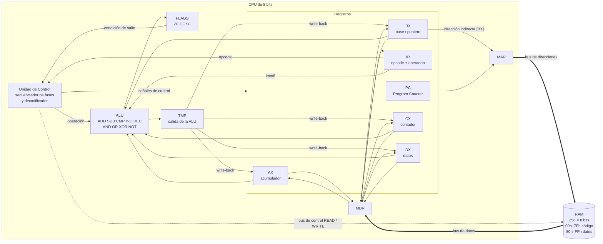
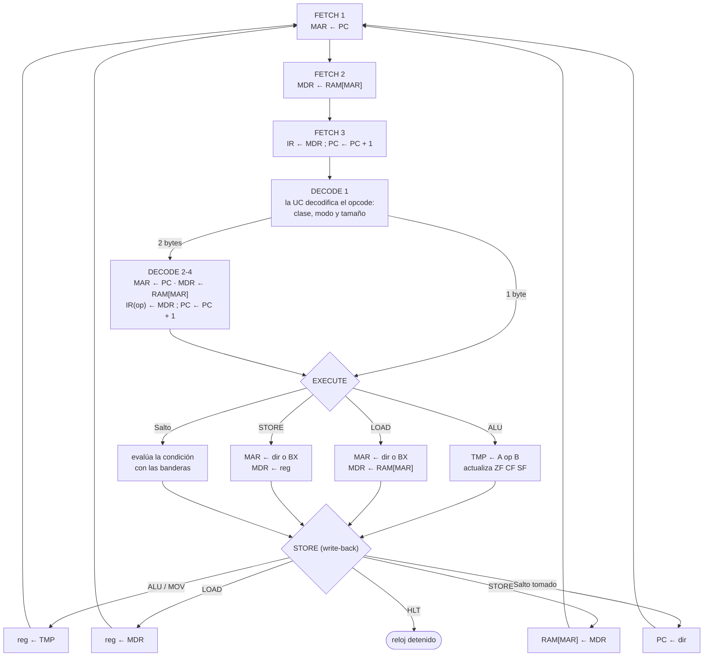

# Simulador de CPU de 8 bits y Memoria Principal (Arquitectura von Neumann / x86 simplificada)

**Materia:** Arquitectura de Computadoras (SIS-131)  
**Estudiante:** Maria Alicia Belaunde Villagomez  
**Docente:** Ing. Paulo César Loayza Carrasco  
**Universidad:** Universidad Católica Boliviana "San Pablo" — Unidad Académica Regional Santa Cruz  
**Evaluación:** Primer Parcial — Proyecto práctico y defensa oral  
**Plataforma:** Microsoft Excel + VBA (`Parcial 1 - Arquitectura de computadoras.xlsm`)  
**Tablero Kanban:** [GitHub Projects](https://github.com/users/aliciabelaunde/projects/9/views/1)

Simulador interactivo que ejecuta programas en lenguaje máquina de 8 bits. Cada instrucción se descompone en las cuatro fases del ciclo de instrucción (**Fetch → Decode → Execute → Store**) y cada fase en micro-operaciones de transferencia entre registros. En cada pulso de reloj la hoja muestra el registro activo, la celda de memoria leída o escrita, la fase en curso, la operación de la ALU y las banderas.

---

## Contenido

1. [Arquitectura del sistema](#1-arquitectura-del-sistema)
2. [Registros](#2-registros)
3. [Memoria principal](#3-memoria-principal)
4. [Ciclo de instrucción y micro-operaciones](#4-ciclo-de-instrucción-y-micro-operaciones)
5. [Conjunto de instrucciones (ISA)](#5-conjunto-de-instrucciones-isa)
6. [Manual de usuario](#6-manual-de-usuario)
7. [Programas demostrativos y traza](#7-programas-demostrativos-y-traza)
8. [Organización del código](#8-organización-del-código)
9. [Pruebas](#9-pruebas)
10. [Estructura del repositorio](#10-estructura-del-repositorio)

---

## 1. Arquitectura del sistema

Arquitectura **von Neumann**: instrucciones y datos comparten una única memoria y un único camino de acceso (MAR/MDR y los buses del sistema).



## 2. Registros

| Registro | Bits | Función | Celda en la hoja |
|---|:---:|---|:---:|
| **PC** | 8 | Dirección de la siguiente instrucción | `B2` |
| **IR** | 8 + 8 | Opcode de la instrucción en curso y su operando (`A1 80`) | `B3` |
| **MAR** | 8 | Dirección que se coloca en el bus de direcciones | `B4` |
| **MDR** | 8 | Dato recién leído de la RAM o que se va a escribir | `B5` |
| **AX** | 8 | Acumulador (propósito general) | `B6` |
| **BX** | 8 | Registro base: propósito general y puntero de memoria para `[BX]` | `B7` |
| **CX** | 8 | Registro contador: contador de bucles | `D5` |
| **DX** | 8 | Registro de datos: propósito general / temporal | `D6` |
| **TMP** | 8 | Latch de salida de la ALU (resultado antes del write-back) | interno |
| **ZF** | 1 | Zero Flag: 1 si el resultado fue 0 | `D2` |
| **CF** | 1 | Carry Flag: acarreo (ADD) o préstamo (SUB/CMP) sin signo | `D3` |
| **SF** | 1 | Sign Flag: copia del bit 7 del resultado (negativo en complemento a 2) | `D4` |

**Cálculo de banderas (compatible con x86):**

| Operación | ZF | SF | CF |
|---|:---:|:---:|---|
| `ADD` | sí | sí | 1 si `a + b > 255` |
| `SUB`, `CMP` | sí | sí | 1 si `a < b` (préstamo) |
| `AND`, `OR`, `XOR` | sí | sí | siempre 0 |
| `INC`, `DEC` | sí | sí | sin cambio |
| `NOT` | — | — | — (no modifica banderas) |

Ejemplos: `0xC8 + 0x64 = 0x2C` con CF=1 · `0x05 − 0x07 = 0xFE` con CF=1 y SF=1 · `0x90 + 0xE9 = 0x79` con CF=1 (144 + 233 = 377 no cabe en 8 bits).

## 3. Memoria principal

- **256 posiciones** de 8 bits, direcciones `00h`–`FFh`.
- Se visualiza como una matriz **16 × 16** en `G3:V18`: la fila indica el nibble alto de la dirección y la columna el nibble bajo (la dirección `82h` está en la fila `80`, columna `02`).
- Cualquier celda puede inspeccionarse en **hexadecimal, decimal, binario y mnemónico** con el *Inspector de memoria* (`A26:D30`).
- Operaciones primitivas: `MemRead(address)` y `MemWrite(address, value)`. Ningún otro procedimiento accede a la memoria directamente.

| Rango | Segmento | Uso | Color |
|---|---|---|---|
| `00h`–`7Fh` | **Código** | Instrucciones del programa | azul |
| `80h`–`FFh` | **Datos** | Variables, arreglos y resultados | verde |

La hoja es la **fuente de verdad** del estado: antes de cada pulso se releen la RAM y los registros, así que cualquier byte editado a mano se ejecuta de inmediato (modificación en vivo).

## 4. Ciclo de instrucción y micro-operaciones

Cada pulso de reloj (`STEP`) ejecuta **una micro-operación**.



| Clase de instrucción | FETCH | DECODE | EXECUTE | STORE | Pulsos totales |
|---|:---:|:---:|:---:|:---:|:---:|
| 1 byte (`ADD AX, BX`, `DEC CX`, `HLT`) | 3 | 1 | 1 | 1 | **6** |
| 2 bytes (`MOV AX, imm8`, `JNZ dir8`, `CMP CX, imm8`) | 3 | 4 | 1 | 1 | **9** |
| `LOAD reg, [dir8]` / `STORE [dir8], reg` | 3 | 4 | 2 | 1 | **10** |
| `LOAD reg, [BX]` / `STORE [BX], reg` | 3 | 1 | 2 | 1 | **7** |

**Ejemplo:** micro-operaciones de `MOV AX, 0x00` (bytes `80 00`) almacenada en la dirección `00h`:

| Pulso | Fase | Micro-operación | Detalle |
|--:|---|---|---|
| 1 | FETCH | `MAR ← PC` | MAR = 0x00 |
| 2 | FETCH | `MDR ← RAM[MAR]` | RAM[0x00] = 0x80 |
| 3 | FETCH | `IR ← MDR ; PC ← PC+1` | IR = 0x80 (MOV), PC = 0x01 |
| 4 | DECODE | La UC decodifica `0x80 = MOV AX, imm8` | modo inmediato, 2 bytes |
| 5 | DECODE | `MAR ← PC` | MAR = 0x01 |
| 6 | DECODE | `MDR ← RAM[MAR]` | RAM[0x01] = 0x00 |
| 7 | DECODE | `IR(op) ← MDR ; PC ← PC+1` | IR = 80 00 → MOV AX, 0x00; PC = 0x02 |
| 8 | EXECUTE | `TMP ← IR(op)` | TMP = 0x00 |
| 9 | STORE | `AX ← TMP` | AX = 0x00 |

## 5. Conjunto de instrucciones (ISA)

**Formato:** 1 byte de opcode + 0 o 1 byte de operando (`imm8` = valor inmediato, `dir8` = dirección de memoria).

```
 ┌───────────────┬─────────────────┐
 │ OPCODE 8 bits │ OPERANDO 8 bits │   (el operando existe solo en instrucciones de 2 bytes)
 └───────────────┴─────────────────┘
```

**Códigos de registro (2 bits), como en x86:** `00` = AX · `01` = BX · `10` = CX · `11` = DX.

**Decodificación por nibbles.** El nibble alto del opcode selecciona el grupo de operación y el nibble bajo selecciona los registros:

| Rango de opcodes | Grupo | Nibble bajo / bits | Ejemplo |
|---|---|---|---|
| `00h` | `NOP` | — | |
| `1Xh`–`7Xh` | Registro ← registro | `dd ss`: bits 3-2 destino, bits 1-0 fuente. Nibble alto: 1 MOV · 2 ADD · 3 SUB · 4 CMP · 5 AND · 6 OR · 7 XOR | `21h` = `0010 00 01` = `ADD AX, BX` |
| `80h`–`9Bh` | Registro ← inmediato | `(opcode − 80h) \ 4`: 0 MOV · 1 ADD · 2 SUB · 3 CMP · 4 AND · 5 OR · 6 XOR; bits 1-0 = registro | `8Ah` = `ADD CX, imm8` |
| `A0h`–`A3h` / `A4h`–`A7h` | `LOAD reg, [dir8]` / `STORE [dir8], reg` | bits 1-0 = registro | `A2h 81h` = `LOAD CX, [0x81]` |
| `A8h`–`ABh` / `ACh`–`AFh` | `LOAD reg, [BX]` / `STORE [BX], reg` (indirecto por registro) | bits 1-0 = registro | `AEh` = `STORE [BX], CX` |
| `B0h`–`BBh` | `INC` / `DEC` / `NOT` | `(opcode − B0h) \ 4`: 0 INC · 1 DEC · 2 NOT; bits 1-0 = registro | `B6h` = `DEC CX` |
| `C0h`–`C6h` | Saltos | `JMP`, `JZ`, `JNZ`, `JC`, `JNC`, `JS`, `JNS` | `C2h 0Ah` = `JNZ 0x0A` |
| `FFh` | `HLT` | — | |

Cualquier opcode fuera de estos rangos detiene la CPU con una excepción de *opcode inválido*.

**Tabla completa (177 opcodes):**

| Opcode | Binario | Instrucción | Bytes | Modo de direccionamiento | Operación (RTL) | Banderas |
|:---:|:---:|---|:---:|---|---|---|
| `00h` | `00000000` | `NOP` | 1 | Implícito | Sin operación | — |
| `10h` | `00010000` | `MOV AX, AX` | 1 | Registro | AX ← AX | — |
| `11h` | `00010001` | `MOV AX, BX` | 1 | Registro | AX ← BX | — |
| `12h` | `00010010` | `MOV AX, CX` | 1 | Registro | AX ← CX | — |
| `13h` | `00010011` | `MOV AX, DX` | 1 | Registro | AX ← DX | — |
| `14h` | `00010100` | `MOV BX, AX` | 1 | Registro | BX ← AX | — |
| `15h` | `00010101` | `MOV BX, BX` | 1 | Registro | BX ← BX | — |
| `16h` | `00010110` | `MOV BX, CX` | 1 | Registro | BX ← CX | — |
| `17h` | `00010111` | `MOV BX, DX` | 1 | Registro | BX ← DX | — |
| `18h` | `00011000` | `MOV CX, AX` | 1 | Registro | CX ← AX | — |
| `19h` | `00011001` | `MOV CX, BX` | 1 | Registro | CX ← BX | — |
| `1Ah` | `00011010` | `MOV CX, CX` | 1 | Registro | CX ← CX | — |
| `1Bh` | `00011011` | `MOV CX, DX` | 1 | Registro | CX ← DX | — |
| `1Ch` | `00011100` | `MOV DX, AX` | 1 | Registro | DX ← AX | — |
| `1Dh` | `00011101` | `MOV DX, BX` | 1 | Registro | DX ← BX | — |
| `1Eh` | `00011110` | `MOV DX, CX` | 1 | Registro | DX ← CX | — |
| `1Fh` | `00011111` | `MOV DX, DX` | 1 | Registro | DX ← DX | — |
| `20h` | `00100000` | `ADD AX, AX` | 1 | Registro | AX ← AX + AX | ZF, CF, SF |
| `21h` | `00100001` | `ADD AX, BX` | 1 | Registro | AX ← AX + BX | ZF, CF, SF |
| `22h` | `00100010` | `ADD AX, CX` | 1 | Registro | AX ← AX + CX | ZF, CF, SF |
| `23h` | `00100011` | `ADD AX, DX` | 1 | Registro | AX ← AX + DX | ZF, CF, SF |
| `24h` | `00100100` | `ADD BX, AX` | 1 | Registro | BX ← BX + AX | ZF, CF, SF |
| `25h` | `00100101` | `ADD BX, BX` | 1 | Registro | BX ← BX + BX | ZF, CF, SF |
| `26h` | `00100110` | `ADD BX, CX` | 1 | Registro | BX ← BX + CX | ZF, CF, SF |
| `27h` | `00100111` | `ADD BX, DX` | 1 | Registro | BX ← BX + DX | ZF, CF, SF |
| `28h` | `00101000` | `ADD CX, AX` | 1 | Registro | CX ← CX + AX | ZF, CF, SF |
| `29h` | `00101001` | `ADD CX, BX` | 1 | Registro | CX ← CX + BX | ZF, CF, SF |
| `2Ah` | `00101010` | `ADD CX, CX` | 1 | Registro | CX ← CX + CX | ZF, CF, SF |
| `2Bh` | `00101011` | `ADD CX, DX` | 1 | Registro | CX ← CX + DX | ZF, CF, SF |
| `2Ch` | `00101100` | `ADD DX, AX` | 1 | Registro | DX ← DX + AX | ZF, CF, SF |
| `2Dh` | `00101101` | `ADD DX, BX` | 1 | Registro | DX ← DX + BX | ZF, CF, SF |
| `2Eh` | `00101110` | `ADD DX, CX` | 1 | Registro | DX ← DX + CX | ZF, CF, SF |
| `2Fh` | `00101111` | `ADD DX, DX` | 1 | Registro | DX ← DX + DX | ZF, CF, SF |
| `30h` | `00110000` | `SUB AX, AX` | 1 | Registro | AX ← AX − AX | ZF, CF, SF |
| `31h` | `00110001` | `SUB AX, BX` | 1 | Registro | AX ← AX − BX | ZF, CF, SF |
| `32h` | `00110010` | `SUB AX, CX` | 1 | Registro | AX ← AX − CX | ZF, CF, SF |
| `33h` | `00110011` | `SUB AX, DX` | 1 | Registro | AX ← AX − DX | ZF, CF, SF |
| `34h` | `00110100` | `SUB BX, AX` | 1 | Registro | BX ← BX − AX | ZF, CF, SF |
| `35h` | `00110101` | `SUB BX, BX` | 1 | Registro | BX ← BX − BX | ZF, CF, SF |
| `36h` | `00110110` | `SUB BX, CX` | 1 | Registro | BX ← BX − CX | ZF, CF, SF |
| `37h` | `00110111` | `SUB BX, DX` | 1 | Registro | BX ← BX − DX | ZF, CF, SF |
| `38h` | `00111000` | `SUB CX, AX` | 1 | Registro | CX ← CX − AX | ZF, CF, SF |
| `39h` | `00111001` | `SUB CX, BX` | 1 | Registro | CX ← CX − BX | ZF, CF, SF |
| `3Ah` | `00111010` | `SUB CX, CX` | 1 | Registro | CX ← CX − CX | ZF, CF, SF |
| `3Bh` | `00111011` | `SUB CX, DX` | 1 | Registro | CX ← CX − DX | ZF, CF, SF |
| `3Ch` | `00111100` | `SUB DX, AX` | 1 | Registro | DX ← DX − AX | ZF, CF, SF |
| `3Dh` | `00111101` | `SUB DX, BX` | 1 | Registro | DX ← DX − BX | ZF, CF, SF |
| `3Eh` | `00111110` | `SUB DX, CX` | 1 | Registro | DX ← DX − CX | ZF, CF, SF |
| `3Fh` | `00111111` | `SUB DX, DX` | 1 | Registro | DX ← DX − DX | ZF, CF, SF |
| `40h` | `01000000` | `CMP AX, AX` | 1 | Registro | AX − AX (solo banderas) | ZF, CF, SF |
| `41h` | `01000001` | `CMP AX, BX` | 1 | Registro | AX − BX (solo banderas) | ZF, CF, SF |
| `42h` | `01000010` | `CMP AX, CX` | 1 | Registro | AX − CX (solo banderas) | ZF, CF, SF |
| `43h` | `01000011` | `CMP AX, DX` | 1 | Registro | AX − DX (solo banderas) | ZF, CF, SF |
| `44h` | `01000100` | `CMP BX, AX` | 1 | Registro | BX − AX (solo banderas) | ZF, CF, SF |
| `45h` | `01000101` | `CMP BX, BX` | 1 | Registro | BX − BX (solo banderas) | ZF, CF, SF |
| `46h` | `01000110` | `CMP BX, CX` | 1 | Registro | BX − CX (solo banderas) | ZF, CF, SF |
| `47h` | `01000111` | `CMP BX, DX` | 1 | Registro | BX − DX (solo banderas) | ZF, CF, SF |
| `48h` | `01001000` | `CMP CX, AX` | 1 | Registro | CX − AX (solo banderas) | ZF, CF, SF |
| `49h` | `01001001` | `CMP CX, BX` | 1 | Registro | CX − BX (solo banderas) | ZF, CF, SF |
| `4Ah` | `01001010` | `CMP CX, CX` | 1 | Registro | CX − CX (solo banderas) | ZF, CF, SF |
| `4Bh` | `01001011` | `CMP CX, DX` | 1 | Registro | CX − DX (solo banderas) | ZF, CF, SF |
| `4Ch` | `01001100` | `CMP DX, AX` | 1 | Registro | DX − AX (solo banderas) | ZF, CF, SF |
| `4Dh` | `01001101` | `CMP DX, BX` | 1 | Registro | DX − BX (solo banderas) | ZF, CF, SF |
| `4Eh` | `01001110` | `CMP DX, CX` | 1 | Registro | DX − CX (solo banderas) | ZF, CF, SF |
| `4Fh` | `01001111` | `CMP DX, DX` | 1 | Registro | DX − DX (solo banderas) | ZF, CF, SF |
| `50h` | `01010000` | `AND AX, AX` | 1 | Registro | AX ← AX AND AX | ZF, SF (CF=0) |
| `51h` | `01010001` | `AND AX, BX` | 1 | Registro | AX ← AX AND BX | ZF, SF (CF=0) |
| `52h` | `01010010` | `AND AX, CX` | 1 | Registro | AX ← AX AND CX | ZF, SF (CF=0) |
| `53h` | `01010011` | `AND AX, DX` | 1 | Registro | AX ← AX AND DX | ZF, SF (CF=0) |
| `54h` | `01010100` | `AND BX, AX` | 1 | Registro | BX ← BX AND AX | ZF, SF (CF=0) |
| `55h` | `01010101` | `AND BX, BX` | 1 | Registro | BX ← BX AND BX | ZF, SF (CF=0) |
| `56h` | `01010110` | `AND BX, CX` | 1 | Registro | BX ← BX AND CX | ZF, SF (CF=0) |
| `57h` | `01010111` | `AND BX, DX` | 1 | Registro | BX ← BX AND DX | ZF, SF (CF=0) |
| `58h` | `01011000` | `AND CX, AX` | 1 | Registro | CX ← CX AND AX | ZF, SF (CF=0) |
| `59h` | `01011001` | `AND CX, BX` | 1 | Registro | CX ← CX AND BX | ZF, SF (CF=0) |
| `5Ah` | `01011010` | `AND CX, CX` | 1 | Registro | CX ← CX AND CX | ZF, SF (CF=0) |
| `5Bh` | `01011011` | `AND CX, DX` | 1 | Registro | CX ← CX AND DX | ZF, SF (CF=0) |
| `5Ch` | `01011100` | `AND DX, AX` | 1 | Registro | DX ← DX AND AX | ZF, SF (CF=0) |
| `5Dh` | `01011101` | `AND DX, BX` | 1 | Registro | DX ← DX AND BX | ZF, SF (CF=0) |
| `5Eh` | `01011110` | `AND DX, CX` | 1 | Registro | DX ← DX AND CX | ZF, SF (CF=0) |
| `5Fh` | `01011111` | `AND DX, DX` | 1 | Registro | DX ← DX AND DX | ZF, SF (CF=0) |
| `60h` | `01100000` | `OR AX, AX` | 1 | Registro | AX ← AX OR AX | ZF, SF (CF=0) |
| `61h` | `01100001` | `OR AX, BX` | 1 | Registro | AX ← AX OR BX | ZF, SF (CF=0) |
| `62h` | `01100010` | `OR AX, CX` | 1 | Registro | AX ← AX OR CX | ZF, SF (CF=0) |
| `63h` | `01100011` | `OR AX, DX` | 1 | Registro | AX ← AX OR DX | ZF, SF (CF=0) |
| `64h` | `01100100` | `OR BX, AX` | 1 | Registro | BX ← BX OR AX | ZF, SF (CF=0) |
| `65h` | `01100101` | `OR BX, BX` | 1 | Registro | BX ← BX OR BX | ZF, SF (CF=0) |
| `66h` | `01100110` | `OR BX, CX` | 1 | Registro | BX ← BX OR CX | ZF, SF (CF=0) |
| `67h` | `01100111` | `OR BX, DX` | 1 | Registro | BX ← BX OR DX | ZF, SF (CF=0) |
| `68h` | `01101000` | `OR CX, AX` | 1 | Registro | CX ← CX OR AX | ZF, SF (CF=0) |
| `69h` | `01101001` | `OR CX, BX` | 1 | Registro | CX ← CX OR BX | ZF, SF (CF=0) |
| `6Ah` | `01101010` | `OR CX, CX` | 1 | Registro | CX ← CX OR CX | ZF, SF (CF=0) |
| `6Bh` | `01101011` | `OR CX, DX` | 1 | Registro | CX ← CX OR DX | ZF, SF (CF=0) |
| `6Ch` | `01101100` | `OR DX, AX` | 1 | Registro | DX ← DX OR AX | ZF, SF (CF=0) |
| `6Dh` | `01101101` | `OR DX, BX` | 1 | Registro | DX ← DX OR BX | ZF, SF (CF=0) |
| `6Eh` | `01101110` | `OR DX, CX` | 1 | Registro | DX ← DX OR CX | ZF, SF (CF=0) |
| `6Fh` | `01101111` | `OR DX, DX` | 1 | Registro | DX ← DX OR DX | ZF, SF (CF=0) |
| `70h` | `01110000` | `XOR AX, AX` | 1 | Registro | AX ← AX XOR AX | ZF, SF (CF=0) |
| `71h` | `01110001` | `XOR AX, BX` | 1 | Registro | AX ← AX XOR BX | ZF, SF (CF=0) |
| `72h` | `01110010` | `XOR AX, CX` | 1 | Registro | AX ← AX XOR CX | ZF, SF (CF=0) |
| `73h` | `01110011` | `XOR AX, DX` | 1 | Registro | AX ← AX XOR DX | ZF, SF (CF=0) |
| `74h` | `01110100` | `XOR BX, AX` | 1 | Registro | BX ← BX XOR AX | ZF, SF (CF=0) |
| `75h` | `01110101` | `XOR BX, BX` | 1 | Registro | BX ← BX XOR BX | ZF, SF (CF=0) |
| `76h` | `01110110` | `XOR BX, CX` | 1 | Registro | BX ← BX XOR CX | ZF, SF (CF=0) |
| `77h` | `01110111` | `XOR BX, DX` | 1 | Registro | BX ← BX XOR DX | ZF, SF (CF=0) |
| `78h` | `01111000` | `XOR CX, AX` | 1 | Registro | CX ← CX XOR AX | ZF, SF (CF=0) |
| `79h` | `01111001` | `XOR CX, BX` | 1 | Registro | CX ← CX XOR BX | ZF, SF (CF=0) |
| `7Ah` | `01111010` | `XOR CX, CX` | 1 | Registro | CX ← CX XOR CX | ZF, SF (CF=0) |
| `7Bh` | `01111011` | `XOR CX, DX` | 1 | Registro | CX ← CX XOR DX | ZF, SF (CF=0) |
| `7Ch` | `01111100` | `XOR DX, AX` | 1 | Registro | DX ← DX XOR AX | ZF, SF (CF=0) |
| `7Dh` | `01111101` | `XOR DX, BX` | 1 | Registro | DX ← DX XOR BX | ZF, SF (CF=0) |
| `7Eh` | `01111110` | `XOR DX, CX` | 1 | Registro | DX ← DX XOR CX | ZF, SF (CF=0) |
| `7Fh` | `01111111` | `XOR DX, DX` | 1 | Registro | DX ← DX XOR DX | ZF, SF (CF=0) |
| `80h` | `10000000` | `MOV AX, imm8` | 2 | Inmediato | AX ← imm8 | — |
| `81h` | `10000001` | `MOV BX, imm8` | 2 | Inmediato | BX ← imm8 | — |
| `82h` | `10000010` | `MOV CX, imm8` | 2 | Inmediato | CX ← imm8 | — |
| `83h` | `10000011` | `MOV DX, imm8` | 2 | Inmediato | DX ← imm8 | — |
| `84h` | `10000100` | `ADD AX, imm8` | 2 | Inmediato | AX ← AX + imm8 | ZF, CF, SF |
| `85h` | `10000101` | `ADD BX, imm8` | 2 | Inmediato | BX ← BX + imm8 | ZF, CF, SF |
| `86h` | `10000110` | `ADD CX, imm8` | 2 | Inmediato | CX ← CX + imm8 | ZF, CF, SF |
| `87h` | `10000111` | `ADD DX, imm8` | 2 | Inmediato | DX ← DX + imm8 | ZF, CF, SF |
| `88h` | `10001000` | `SUB AX, imm8` | 2 | Inmediato | AX ← AX − imm8 | ZF, CF, SF |
| `89h` | `10001001` | `SUB BX, imm8` | 2 | Inmediato | BX ← BX − imm8 | ZF, CF, SF |
| `8Ah` | `10001010` | `SUB CX, imm8` | 2 | Inmediato | CX ← CX − imm8 | ZF, CF, SF |
| `8Bh` | `10001011` | `SUB DX, imm8` | 2 | Inmediato | DX ← DX − imm8 | ZF, CF, SF |
| `8Ch` | `10001100` | `CMP AX, imm8` | 2 | Inmediato | AX − imm8 (solo banderas) | ZF, CF, SF |
| `8Dh` | `10001101` | `CMP BX, imm8` | 2 | Inmediato | BX − imm8 (solo banderas) | ZF, CF, SF |
| `8Eh` | `10001110` | `CMP CX, imm8` | 2 | Inmediato | CX − imm8 (solo banderas) | ZF, CF, SF |
| `8Fh` | `10001111` | `CMP DX, imm8` | 2 | Inmediato | DX − imm8 (solo banderas) | ZF, CF, SF |
| `90h` | `10010000` | `AND AX, imm8` | 2 | Inmediato | AX ← AX AND imm8 | ZF, SF (CF=0) |
| `91h` | `10010001` | `AND BX, imm8` | 2 | Inmediato | BX ← BX AND imm8 | ZF, SF (CF=0) |
| `92h` | `10010010` | `AND CX, imm8` | 2 | Inmediato | CX ← CX AND imm8 | ZF, SF (CF=0) |
| `93h` | `10010011` | `AND DX, imm8` | 2 | Inmediato | DX ← DX AND imm8 | ZF, SF (CF=0) |
| `94h` | `10010100` | `OR AX, imm8` | 2 | Inmediato | AX ← AX OR imm8 | ZF, SF (CF=0) |
| `95h` | `10010101` | `OR BX, imm8` | 2 | Inmediato | BX ← BX OR imm8 | ZF, SF (CF=0) |
| `96h` | `10010110` | `OR CX, imm8` | 2 | Inmediato | CX ← CX OR imm8 | ZF, SF (CF=0) |
| `97h` | `10010111` | `OR DX, imm8` | 2 | Inmediato | DX ← DX OR imm8 | ZF, SF (CF=0) |
| `98h` | `10011000` | `XOR AX, imm8` | 2 | Inmediato | AX ← AX XOR imm8 | ZF, SF (CF=0) |
| `99h` | `10011001` | `XOR BX, imm8` | 2 | Inmediato | BX ← BX XOR imm8 | ZF, SF (CF=0) |
| `9Ah` | `10011010` | `XOR CX, imm8` | 2 | Inmediato | CX ← CX XOR imm8 | ZF, SF (CF=0) |
| `9Bh` | `10011011` | `XOR DX, imm8` | 2 | Inmediato | DX ← DX XOR imm8 | ZF, SF (CF=0) |
| `A0h` | `10100000` | `LOAD AX, [dir8]` | 2 | Directo | AX ← RAM[dir8] | — |
| `A1h` | `10100001` | `LOAD BX, [dir8]` | 2 | Directo | BX ← RAM[dir8] | — |
| `A2h` | `10100010` | `LOAD CX, [dir8]` | 2 | Directo | CX ← RAM[dir8] | — |
| `A3h` | `10100011` | `LOAD DX, [dir8]` | 2 | Directo | DX ← RAM[dir8] | — |
| `A4h` | `10100100` | `STORE [dir8], AX` | 2 | Directo | RAM[dir8] ← AX | — |
| `A5h` | `10100101` | `STORE [dir8], BX` | 2 | Directo | RAM[dir8] ← BX | — |
| `A6h` | `10100110` | `STORE [dir8], CX` | 2 | Directo | RAM[dir8] ← CX | — |
| `A7h` | `10100111` | `STORE [dir8], DX` | 2 | Directo | RAM[dir8] ← DX | — |
| `A8h` | `10101000` | `LOAD AX, [BX]` | 1 | Indirecto por registro | AX ← RAM[BX] | — |
| `A9h` | `10101001` | `LOAD BX, [BX]` | 1 | Indirecto por registro | BX ← RAM[BX] | — |
| `AAh` | `10101010` | `LOAD CX, [BX]` | 1 | Indirecto por registro | CX ← RAM[BX] | — |
| `ABh` | `10101011` | `LOAD DX, [BX]` | 1 | Indirecto por registro | DX ← RAM[BX] | — |
| `ACh` | `10101100` | `STORE [BX], AX` | 1 | Indirecto por registro | RAM[BX] ← AX | — |
| `ADh` | `10101101` | `STORE [BX], BX` | 1 | Indirecto por registro | RAM[BX] ← BX | — |
| `AEh` | `10101110` | `STORE [BX], CX` | 1 | Indirecto por registro | RAM[BX] ← CX | — |
| `AFh` | `10101111` | `STORE [BX], DX` | 1 | Indirecto por registro | RAM[BX] ← DX | — |
| `B0h` | `10110000` | `INC AX` | 1 | Registro | AX ← AX + 1 | ZF, SF |
| `B1h` | `10110001` | `INC BX` | 1 | Registro | BX ← BX + 1 | ZF, SF |
| `B2h` | `10110010` | `INC CX` | 1 | Registro | CX ← CX + 1 | ZF, SF |
| `B3h` | `10110011` | `INC DX` | 1 | Registro | DX ← DX + 1 | ZF, SF |
| `B4h` | `10110100` | `DEC AX` | 1 | Registro | AX ← AX − 1 | ZF, SF |
| `B5h` | `10110101` | `DEC BX` | 1 | Registro | BX ← BX − 1 | ZF, SF |
| `B6h` | `10110110` | `DEC CX` | 1 | Registro | CX ← CX − 1 | ZF, SF |
| `B7h` | `10110111` | `DEC DX` | 1 | Registro | DX ← DX − 1 | ZF, SF |
| `B8h` | `10111000` | `NOT AX` | 1 | Registro | AX ← NOT AX | — |
| `B9h` | `10111001` | `NOT BX` | 1 | Registro | BX ← NOT BX | — |
| `BAh` | `10111010` | `NOT CX` | 1 | Registro | CX ← NOT CX | — |
| `BBh` | `10111011` | `NOT DX` | 1 | Registro | DX ← NOT DX | — |
| `C0h` | `11000000` | `JMP dir8` | 2 | Absoluto (salto) | PC ← dir8 | — |
| `C1h` | `11000001` | `JZ dir8` | 2 | Absoluto (salto) | si ZF=1: PC ← dir8 | — |
| `C2h` | `11000010` | `JNZ dir8` | 2 | Absoluto (salto) | si ZF=0: PC ← dir8 | — |
| `C3h` | `11000011` | `JC dir8` | 2 | Absoluto (salto) | si CF=1: PC ← dir8 | — |
| `C4h` | `11000100` | `JNC dir8` | 2 | Absoluto (salto) | si CF=0: PC ← dir8 | — |
| `C5h` | `11000101` | `JS dir8` | 2 | Absoluto (salto) | si SF=1: PC ← dir8 | — |
| `C6h` | `11000110` | `JNS dir8` | 2 | Absoluto (salto) | si SF=0: PC ← dir8 | — |
| `FFh` | `11111111` | `HLT` | 1 | Implícito | Detiene el reloj | — |

## 6. Manual de usuario

### Instalación
1. Descargar `Parcial 1 - Arquitectura de computadoras.xlsm`.
2. Clic derecho sobre el archivo → **Propiedades** → marcar **Desbloquear** (Windows bloquea las macros de archivos descargados).
3. Abrir en Excel y pulsar **Habilitar contenido**.
4. (Solo la primera vez, o si faltan los botones) `Alt + F8` → **ConfigurarSimulador** → **Ejecutar**.

### Controles

| Botón | Acción |
|---|---|
| **STEP (micro-op)** | Ejecuta un pulso de reloj: una micro-operación |
| **STEP INSTR** | Ejecuta la instrucción actual completa (sus 4 fases) |
| **RUN** | Ejecución continua animada; el retardo entre pulsos se ajusta en `B24` (ms) |
| **PAUSE** | Detiene RUN (también la tecla `Esc`) |
| **RESET** | Pone registros, banderas y PC en 00h. La memoria se conserva |
| **LOAD PROGRAM** | Carga en la RAM el programa elegido en `B25` (Multiplicacion, Fibonacci, Factorial, Cuenta regresiva) y reinicia la CPU |

### Lectura de la pantalla

| Zona | Qué muestra |
|---|---|
| Registros `A1:D7` | PC, IR, MAR, MDR, AX, BX en `B2:B7`, banderas en `D2:D4`, CX y DX en `D5:D6`; en **amarillo** los registros que intervienen en la micro-operación |
| RAM `G3:V18` | **Amarillo**: bytes de la instrucción en curso · **verde**: celda leída · **rojo**: celda escrita |
| Unidad de control `A17:D24` | Fase activa en color, micro-operación en notación RTL, instrucción, operación de la ALU y contador de pulsos |
| Selector de programa `B25` | Lista desplegable con los cuatro programas demostrativos |
| Log `Y2:AB20` | Últimas micro-operaciones, p. ej. `[Paso 008] FETCH: MAR ← PC \| MAR=0x0A`. El historial completo está en la hoja **Log** |
| Inspector `A26:D30` | Escribir una dirección en `B27` para ver su contenido en hex, decimal, binario y mnemónico |

### Demostración paso a paso
1. Elegir **Multiplicacion** en `B25` y pulsar **LOAD PROGRAM** → aparecen los bytes del programa en `00h`–`10h` y los datos `07`, `03` en `80h`–`81h`.
2. **STEP (micro-op)** tres veces: se observa la fase FETCH completa (PC → MAR, lectura de RAM, IR ← MDR).
3. **STEP INSTR** para avanzar instrucción por instrucción; las banderas cambian en `CMP` y `DEC CX`, y en `JZ`/`JNZ` el log indica si el salto se toma.
4. **RUN** con `B24 = 100` para ver el bucle completo hasta `HLT`.
5. Resultado: `RAM[82h] = 15h` (21 decimal) y `AX = 15h`.

### Modificación del programa en vivo
Cualquier celda de la RAM puede editarse escribiendo un byte hexadecimal (`00`–`FF`). Ejemplos:
- Cambiar el multiplicador: `81h` de `03` a `05` → RESET → RUN → `82h = 23h` (35).
- Reemplazar `ADD AX, BX` (dirección `0Ah` = `21`) por `SUB AX, BX` (`31`).
- Usar `CX` como sumando en lugar de `BX`: escribir `22` (`ADD AX, CX`) en `0Ah`.
- Consultar la tabla ISA para escribir cualquier otra instrucción.

## 7. Programas demostrativos y traza

Se incluyen cuatro programas (los sugeridos en el enunciado). Se elige uno en `B25` y se pulsa **LOAD PROGRAM**. Todos usan los cuatro registros de propósito general, bucles y bifurcaciones condicionales.

| Programa | Qué hace | Instrucciones ejecutadas | Pulsos de reloj | Resultado final |
|---|---|:--:|:--:|---|
| **Multiplicacion** | `RES = A × B` por sumas sucesivas (7 × 3) | 16 | 126 | `RAM[82h] = 15h` (21) |
| **Fibonacci** | Serie de Fibonacci hasta desbordar 8 bits (CF = 1), guardada con `[BX]` | 105 | 727 | `A0h–ACh` = 1, 1, 2, 3, 5, 8, 13, 21, 34, 55, 89, 144, 233 |
| **Factorial** | `RES = N!` con bucles anidados de sumas (5!) | 64 | 467 | `RAM[81h] = 78h` (120) |
| **Cuenta regresiva** | Cuenta desde N = 10 y guarda solo los pares (guardado condicional con `AND`) | 90 | 715 | `A0h–A5h` = 10, 8, 6, 4, 2, 0 |

### 7.1 Multiplicación por sumas sucesivas (programa por defecto)

`RES = A × B` con `A = 7` y `B = 3`. `BX` guarda el multiplicando, `CX` es el contador del bucle y `AX` acumula el resultado.

| Dir | Bytes | Etiqueta | Instrucción | Comentario |
|:--:|---|---|---|---|
| 00h | `A1 80` | INICIO | `LOAD BX, [A]` | BX = A (multiplicando) |
| 02h | `A2 81` |  | `LOAD CX, [B]` | CX = B (contador) |
| 04h | `80 00` |  | `MOV AX, 0` | AX = 0 (acumulador) |
| 06h | `8E 00` |  | `CMP CX, 0` | B = 0? |
| 08h | `C1 0E` |  | `JZ FIN` | si B = 0 el producto es 0 |
| 0Ah | `21` | BUCLE | `ADD AX, BX` | AX = AX + A |
| 0Bh | `B6` |  | `DEC CX` | CX = CX - 1 (actualiza ZF) |
| 0Ch | `C2 0A` |  | `JNZ BUCLE` | repetir mientras CX <> 0 |
| 0Eh | `A4 82` | FIN | `STORE [RES], AX` | RES = AX |
| 10h | `FF` |  | `HLT` |  |
| 80h | `07` | A | `DB 7` | multiplicando |
| 81h | `03` | B | `DB 3` | multiplicador |
| 82h | `00` | RES | `DB 0` | resultado |

**Análisis matemático:**

| Iteración | CX antes | AX = AX + BX | CX después de `DEC CX` | ZF | `JNZ` |
|:--:|:--:|---|:--:|:--:|---|
| 1 | 3 | 0 + 7 = **7** (07h) | 2 | 0 | salta a 0Ah |
| 2 | 2 | 7 + 7 = **14** (0Eh) | 1 | 0 | salta a 0Ah |
| 3 | 1 | 14 + 7 = **21** (15h) | 0 | 1 | no salta → STORE, HLT |

Resultado: **7 × 3 = 21 = 15h** en `RAM[82h]`, en **16 instrucciones** y **126 pulsos de reloj**. Si `B = 0`, `CMP CX, 0` pone ZF = 1 y `JZ` salta directamente a `FIN`.

**Traza de registros** (estado después de cada instrucción):

| # | Dir | Instrucción | AX | BX | CX | DX | ZF | CF | SF | PC sig. | Efecto |
|--:|:--:|---|:--:|:--:|:--:|:--:|:--:|:--:|:--:|:--:|---|
| 1 | 00h | `LOAD BX, [0x80]` | 00h | 07h | 00h | 00h | 0 | 0 | 0 | 02h |  |
| 2 | 02h | `LOAD CX, [0x81]` | 00h | 07h | 03h | 00h | 0 | 0 | 0 | 04h |  |
| 3 | 04h | `MOV AX, 0x00` | 00h | 07h | 03h | 00h | 0 | 0 | 0 | 06h |  |
| 4 | 06h | `CMP CX, 0x00` | 00h | 07h | 03h | 00h | 0 | 0 | 0 | 08h |  |
| 5 | 08h | `JZ 0x0E` | 00h | 07h | 03h | 00h | 0 | 0 | 0 | 0Ah | no salta |
| 6 | 0Ah | `ADD AX, BX` | 07h | 07h | 03h | 00h | 0 | 0 | 0 | 0Bh |  |
| 7 | 0Bh | `DEC CX` | 07h | 07h | 02h | 00h | 0 | 0 | 0 | 0Ch |  |
| 8 | 0Ch | `JNZ 0x0A` | 07h | 07h | 02h | 00h | 0 | 0 | 0 | 0Ah | salto tomado |
| 9 | 0Ah | `ADD AX, BX` | 0Eh | 07h | 02h | 00h | 0 | 0 | 0 | 0Bh |  |
| 10 | 0Bh | `DEC CX` | 0Eh | 07h | 01h | 00h | 0 | 0 | 0 | 0Ch |  |
| 11 | 0Ch | `JNZ 0x0A` | 0Eh | 07h | 01h | 00h | 0 | 0 | 0 | 0Ah | salto tomado |
| 12 | 0Ah | `ADD AX, BX` | 15h | 07h | 01h | 00h | 0 | 0 | 0 | 0Bh |  |
| 13 | 0Bh | `DEC CX` | 15h | 07h | 00h | 00h | 1 | 0 | 0 | 0Ch |  |
| 14 | 0Ch | `JNZ 0x0A` | 15h | 07h | 00h | 00h | 1 | 0 | 0 | 0Eh | no salta |
| 15 | 0Eh | `STORE [0x82], AX` | 15h | 07h | 00h | 00h | 1 | 0 | 0 | 10h | RAM[0x82] ← 0x15 |
| 16 | 10h | `HLT` | 15h | 07h | 00h | 00h | 1 | 0 | 0 | 11h | fin del programa |

### 7.2 Fibonacci hasta desbordar 8 bits

`AX` = F(n−1), `CX` = F(n), `DX` = F(n+1) y `BX` es un puntero que recorre el arreglo en `A0h` con direccionamiento indirecto por registro (`STORE [BX], CX`). El bucle termina cuando `ADD DX, CX` produce acarreo: 144 + 233 = 377 > 255 → **CF = 1** → `JC FIN`.

| Dir | Bytes | Etiqueta | Instrucción | Comentario |
|:--:|---|---|---|---|
| 00h | `80 00` | INICIO | `MOV AX, 0` | AX = F(n-1) = 0 |
| 02h | `82 01` |  | `MOV CX, 1` | CX = F(n) = 1 |
| 04h | `81 A0` |  | `MOV BX, 0xA0` | BX = puntero al arreglo SERIE |
| 06h | `AE` | BUCLE | `STORE [BX], CX` | SERIE[i] = F(n)  (indirecto) |
| 07h | `B1` |  | `INC BX` | siguiente posicion |
| 08h | `1C` |  | `MOV DX, AX` | DX = F(n-1) |
| 09h | `2E` |  | `ADD DX, CX` | DX = F(n-1) + F(n) |
| 0Ah | `C3 10` |  | `JC FIN` | CF = 1: ya no cabe en 8 bits |
| 0Ch | `12` |  | `MOV AX, CX` | F(n-1) = F(n) |
| 0Dh | `1B` |  | `MOV CX, DX` | F(n) = F(n+1) |
| 0Eh | `C0 06` |  | `JMP BUCLE` |  |
| 10h | `FF` | FIN | `HLT` |  |

### 7.3 Factorial con sumas sucesivas anidadas

`AX` = resultado parcial, `CX` = factor actual, `BX` = valor a sumar, `DX` = contador del bucle interno. El bucle interno calcula `AX = AX × CX` como `CX − 1` sumas; el bucle externo decrementa `CX` hasta que `CX < 2` (`CMP CX, 2` → CF = 1 → `JC FIN`). Con `N = 5`: 1 → 5 → 20 → 60 → **120 = 78h**.

| Dir | Bytes | Etiqueta | Instrucción | Comentario |
|:--:|---|---|---|---|
| 00h | `A2 80` | INICIO | `LOAD CX, [N]` | CX = N |
| 02h | `80 01` |  | `MOV AX, 1` | AX = 1 (resultado parcial) |
| 04h | `8E 02` | EXT | `CMP CX, 2` |  |
| 06h | `C3 12` |  | `JC FIN` | si CX < 2 terminar |
| 08h | `14` |  | `MOV BX, AX` | BX = valor a sumar |
| 09h | `1E` |  | `MOV DX, CX` |  |
| 0Ah | `B7` |  | `DEC DX` | DX = CX - 1 sumas |
| 0Bh | `21` | INT | `ADD AX, BX` | AX = AX + BX |
| 0Ch | `B7` |  | `DEC DX` |  |
| 0Dh | `C2 0B` |  | `JNZ INT` | AX = AX x CX por sumas sucesivas |
| 0Fh | `B6` |  | `DEC CX` |  |
| 10h | `C0 04` |  | `JMP EXT` |  |
| 12h | `A4 81` | FIN | `STORE [RES], AX` | RES = N! |
| 14h | `FF` |  | `HLT` |  |
| 80h | `05` | N | `DB 5` | N |
| 81h | `00` | RES | `DB 0` | resultado (5! = 120 = 78h) |

### 7.4 Cuenta regresiva con guardado condicional

`CX` cuenta hacia atrás desde `N = 10`. `DX = CX AND 1` pone ZF = 1 cuando el valor es par; solo entonces `STORE [BX], CX` lo guarda y `BX` avanza. Resultado en `A0h`–`A5h`: 10, 8, 6, 4, 2, 0.

| Dir | Bytes | Etiqueta | Instrucción | Comentario |
|:--:|---|---|---|---|
| 00h | `A2 80` | INICIO | `LOAD CX, [N]` | CX = N |
| 02h | `81 A0` |  | `MOV BX, 0xA0` | BX = puntero al arreglo PARES |
| 04h | `1E` | BUCLE | `MOV DX, CX` |  |
| 05h | `93 01` |  | `AND DX, 1` | ZF = 1 si CX es par |
| 07h | `C2 0B` |  | `JNZ SIGUE` | impar: no se guarda |
| 09h | `AE` |  | `STORE [BX], CX` | guardado condicional |
| 0Ah | `B1` |  | `INC BX` |  |
| 0Bh | `8E 00` | SIGUE | `CMP CX, 0` |  |
| 0Dh | `C1 12` |  | `JZ FIN` | llego a 0 |
| 0Fh | `B6` |  | `DEC CX` |  |
| 10h | `C0 04` |  | `JMP BUCLE` |  |
| 12h | `FF` | FIN | `HLT` |  |
| 80h | `0A` | N | `DB 10` | valor inicial |

## 8. Organización del código

Todo el código está en el módulo VBA `modSimulador` ([`src/modSimulador.bas`](src/modSimulador.bas)), dividido en secciones independientes:

| Sección | Procedimientos | Responsabilidad |
|---|---|---|
| 1. Utilidades | `B8`, `H2`, `HX`, `Bin8`, `LeerHex` | Conversión y recorte a 8 bits |
| 2. Memoria | `MemRead`, `MemWrite` | Operaciones primitivas de la RAM |
| 3. Decodificador | `Decodificar`, `RegCod`, `OpNombre`, `TextoInstr`, `ModoDir`, `Mnemonico` | Interpretación del opcode por nibbles (ISA) |
| 4. ALU | `ALU` | Operaciones aritméticas y lógicas, banderas |
| 5. Unidad de control | `MicroPaso`, `UFetch`, `UDecode`, `UExecute`, `UStore` | Secuenciador de fases y micro-operaciones |
| 6. Estado | `CargarEstado`, `GuardarEstado` | Sincronización entre la hoja y los registros |
| 7. Interfaz | `Pintar`, `RegistrarLog` | Resaltado y log |
| 8. Botones y programas | `BtnStep`, `BtnStepInstr`, `BtnRun`, `BtnPause`, `BtnReset`, `BtnLoadProgram`, `ProgMultiplicacion`, `ProgFibonacci`, `ProgFactorial`, `ProgCuentaRegresiva` | Controles y programas demostrativos |
| 9. Configuración | `ConfigurarSimulador`, `CrearBotones` | Construcción de paneles y botones |

**Escalabilidad hacia el Parcial 2:** la unidad de control no accede a la hoja; solo usa `MemRead`/`MemWrite` y deja sus resultados en variables que la interfaz dibuja. Para agregar el bus del sistema multiplexado y los dispositivos de E/S basta con interponer un módulo de bus en esas dos rutinas y añadir una verificación de interrupciones al final de `UStore`.

## 9. Pruebas

| # | Prueba | Resultado esperado | Estado |
|---|---|---|:---:|
| 1 | Compilar el proyecto VBA | Sin errores | ✅ |
| 2 | Multiplicacion: LOAD PROGRAM + 3 × STEP | FETCH completo: MAR=00, MDR=A1, IR=A1, PC=01 | ✅ |
| 3 | Multiplicacion: RUN hasta HLT | AX=15h, CX=00h, RAM[82h]=15h, ZF=1, 16 instrucciones | ✅ |
| 4 | RUN + PAUSE + STEP | Continúa desde el pulso donde se detuvo | ✅ |
| 5 | Editar RAM[81h]=05 y RUN | RAM[82h]=23h (7 × 5 = 35) | ✅ |
| 6 | Editar RAM[81h]=00 y RUN | JZ tomado, RAM[82h]=00h | ✅ |
| 7 | Fibonacci: RUN hasta HLT | A0h–ACh = 01 01 02 03 05 08 0D 15 22 37 59 90 E9, CF=1 | ✅ |
| 8 | Factorial: RUN hasta HLT | RAM[81h]=78h (120) | ✅ |
| 9 | Cuenta regresiva: RUN hasta HLT | A0h–A5h = 0A 08 06 04 02 00 | ✅ |
| 10 | Escribir un opcode inválido (p. ej. `D0`) en la dirección del PC | La CPU se detiene en DECODE con "opcode invalido" | ✅ |

## 10. Estructura del repositorio

```
├── README.md                                       Documentación técnica
├── Parcial 1 - Arquitectura de computadoras.xlsm   Libro de Excel con la interfaz y las macros
└── src/
    └── modSimulador.bas                            Código fuente VBA exportado
```